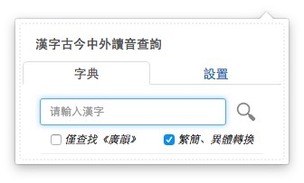
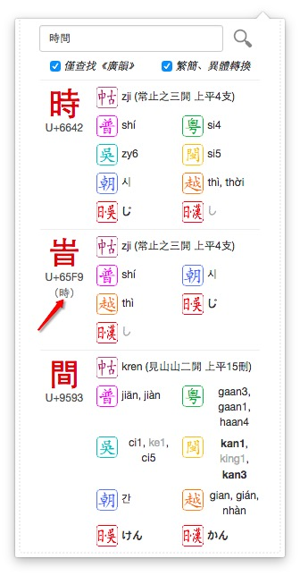
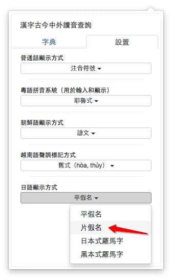
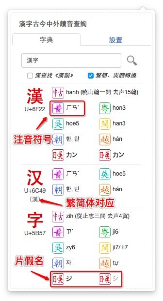

###MCPDict-Kanji Chrome-Extension  
######漢字古今中外讀音查詢 谷歌瀏覽器插件  

---

- 分離出查找漢字讀音的功能  

- 支持顯示模式  

- 使用截屏  
	- 初始界面  
	
	- 搜索結果界面  
	
	- 勾選顯示模式  
	
	- 顯示結果  
	

Chrome Extension  
	插件打包文件`*.crx`和對應證書`*.pem`在外層文件夾下  

